<p align="center">
  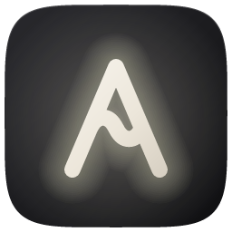
</p>

<h1 align="center">Audian</h1>

<p align="center">
  <b>Open-source voice dictation for Windows. Speak naturally, get polished text wherever you type.</b><br>
  Private by default: speech recognition and rewriting run on your own CPU.
</p>

<p align="center">
  <a href="https://github.com/LucassTml/audian/releases/latest"></a>
  
  
  
  <a href="LICENSE"></a>
</p>

<p align="center">
  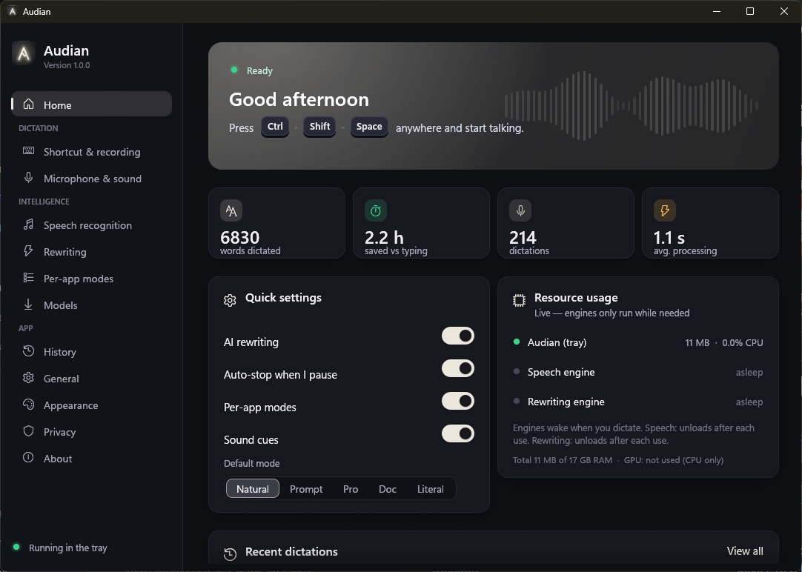
</p>

Audian is an **open-source dictation app inspired by [Wispr Flow](https://wisprflow.ai)**. Press a
shortcut in any app, talk the way you normally talk ("um, so basically I want to like fix the
login bug, no wait, the signup bug"), and a clean version of what you *meant* is typed for you,
in ChatGPT, Claude, VS Code, Word, Slack, Outlook, a browser or a terminal.

Unlike cloud dictation tools, Audian runs speech recognition (**Whisper** or **NVIDIA Parakeet**) and a
small **Qwen** language model (rewriting) **locally**, with no account, no subscription and no audio
leaving your PC.

> Audian is an independent project. It is not affiliated with, endorsed by or connected to
> Wispr Flow or its makers; it is simply inspired by the idea.

## Highlights

- 🎙️ **Speak anywhere.** One global shortcut works in every app. Hold it to talk, or tap it once
  and just talk: Audian notices when you've finished.
- ✨ **Says what you meant.** Removes "um"s and false starts, resolves self-corrections ("Tuesday,
  no, Wednesday" → "Wednesday"), fixes punctuation, and keeps your language and your voice.
- 🧠 **Six writing modes.** Natural, AI Prompt, Professional, Document, Literal and Custom. Per-app
  rules pick one automatically: AI Prompt in ChatGPT or VS Code, Professional in Outlook, and so on.
- 🔒 **Private by default.** whisper.cpp, Parakeet and llama.cpp run on the CPU. Nothing is sent
  anywhere unless you opt in to the cloud rewriting provider (Antigravity).
- 🎧 **Two speech engines.** Whisper (99 languages) or NVIDIA Parakeet (faster and more accurate,
  25 European languages), both offline on your CPU.
- 🪶 **Light.** The tray app idles at about 11 MB of RAM and 0 % CPU. The AI engines load while you
  speak and exit as soon as your text is inserted.
- ⚡ **Fast.** Usually 0.5 to 2 s from the end of your sentence to text on screen, on CPU only.
- 🌍 **Multilingual.** 99 languages for recognition, bilingual auto-detection, and
  translate-as-you-dictate (speak Portuguese, get English).
- 🎨 **Themes and light mode.** Six colour themes (Ivory, Violet, Ocean, Mint, Sunset, Rose), a light
  or dark window (or follow Windows), and a dark or light recording indicator.
- 📋 **Clipboard-safe.** Your clipboard is restored after pasting, and dictated text is kept out of
  Windows clipboard history.
- 🕘 **History and stats.** Recent dictations (text only, never audio), words dictated, time saved.

## Download

Get **[Audian-Setup-1.1.0-x64.exe](https://github.com/LucassTml/audian/releases/latest)** from the
Releases page and run it.

- Installs for your Windows account only, so no administrator rights are needed.
- It can download the AI models during setup (about 1.5 GB, verified with SHA-256), or the welcome
  screen does it on first launch.
- Requirements: Windows 10 or 11, 64-bit, a CPU with AVX2 (most PCs since 2015), 8 GB of RAM
  recommended.

> The installer is not code-signed yet, so Windows SmartScreen may show "Windows protected your
> PC". Choose **More info › Run anyway**. You can check the download against the SHA-256 listed
> in the release notes.

Silent install: `Audian-Setup-1.1.0-x64.exe --quiet [--with-models] [--no-autostart] [--no-launch] [--desktop-shortcut]`.
Uninstall from *Settings › Apps*, or run `uninstall.exe --uninstall [--quiet] [--purge]`.

## How to use

| Action | Default |
|---|---|
| Push-to-talk | Hold `Ctrl` + `Shift` + `Space` while speaking, release to insert |
| Hands-free | Tap the shortcut once, speak, then pause; Audian finishes by itself (or tap again) |
| Cancel | `Esc` |
| Paste the last dictation again | `Ctrl` + `Shift` + `Alt` + `V` |

Left-click the tray icon to open the Audian window (dashboard, settings, history, models).
Right-click it for quick options such as mode, output language and microphone.

A small indicator follows your text cursor while you dictate:

<p align="center">
  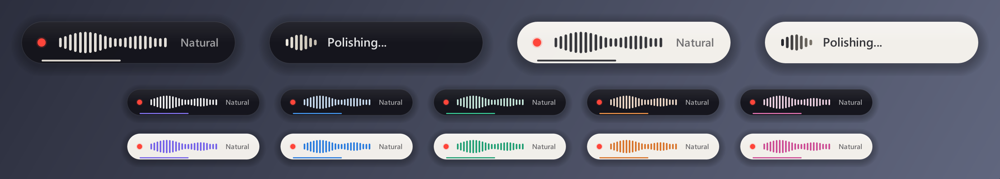
</p>

## Screenshots

<p align="center">
  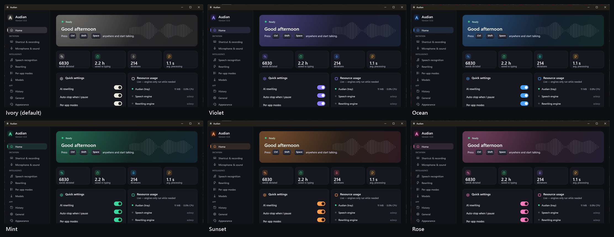<br>
  <sub>Six themes. Ivory (off-white) is the default.</sub>
</p>

<p align="center">
  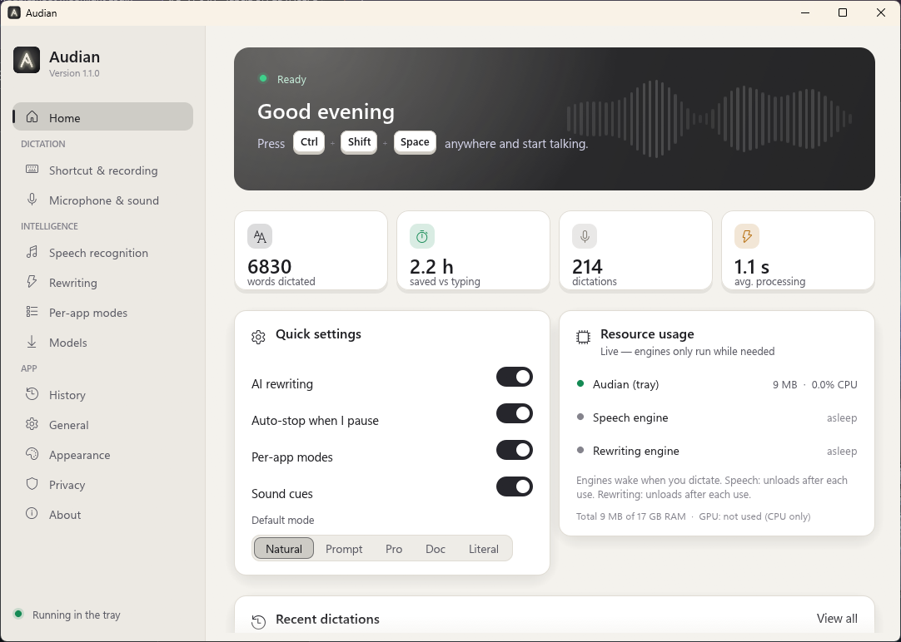<br>
  <sub>Light mode.</sub>
</p>

| | |
|---|---|
| 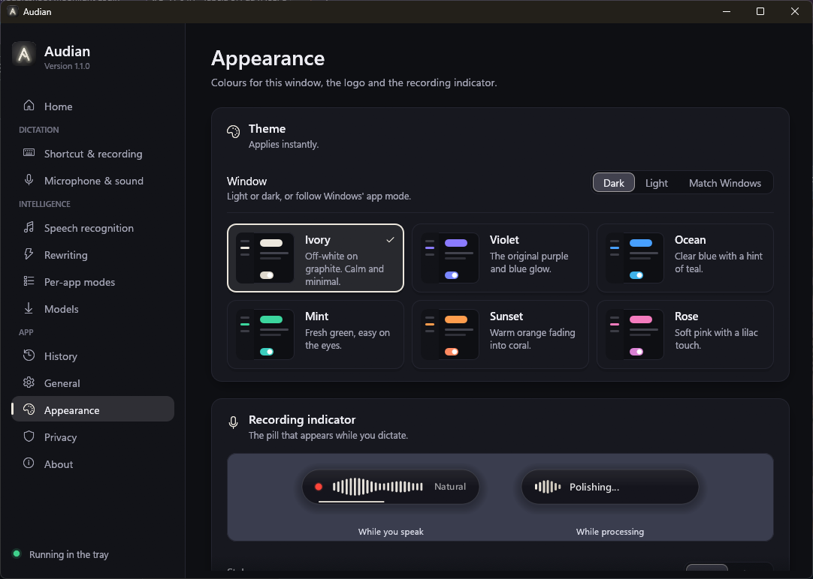 | 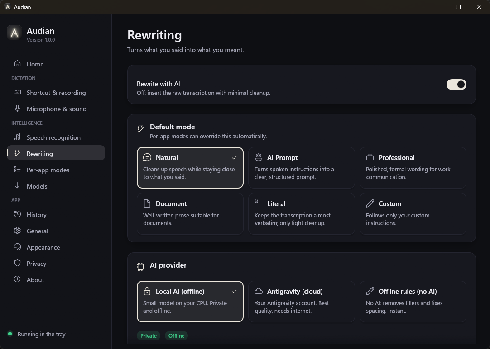 |
| **Appearance:** light or dark window, theme and recording indicator, with a live preview | **Rewriting:** modes and AI provider |
| 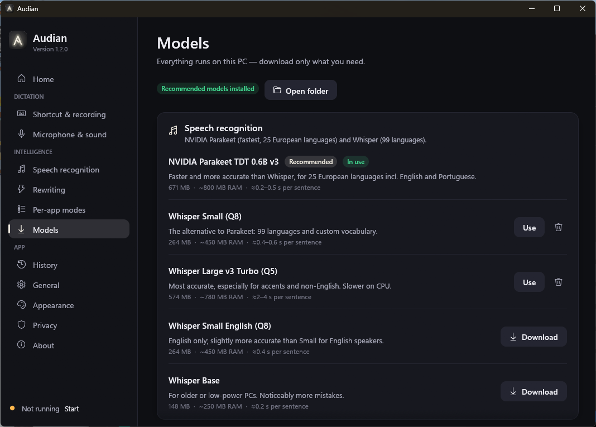 | 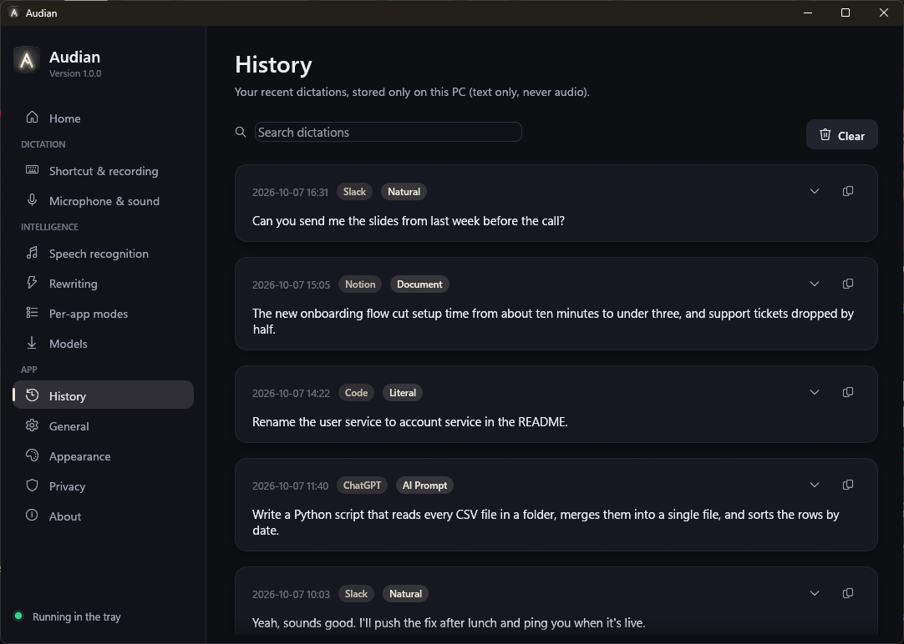 |
| **Models:** download, switch and remove, with RAM and speed for each | **History:** what you said and what was typed |
| 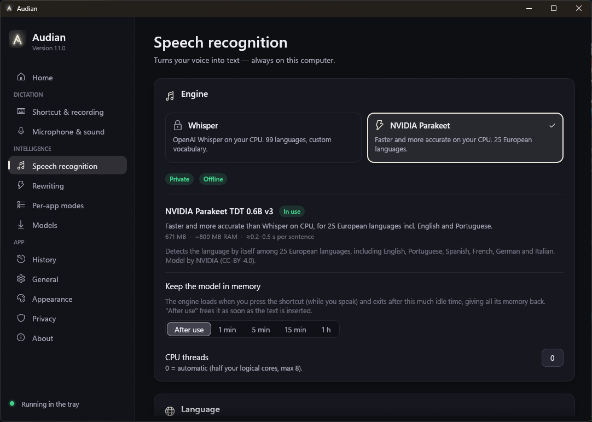 | 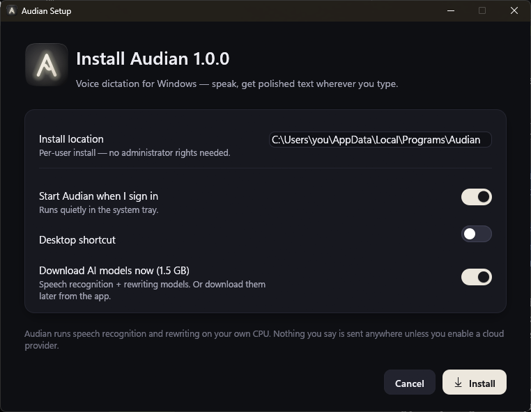 |
| **Speech recognition:** Whisper or NVIDIA Parakeet | **Installer:** per-user, optional model download |

## How it works

```
 shortcut ─► record mic ─► voice detection ─► Whisper (local) ─► rewrite ─► paste at your cursor
             (WASAPI)      adaptive noise      speech-to-text     Qwen 3.5 2B (local),
                           floor, smart        on the CPU         Antigravity (cloud, opt-in)
                           auto-stop                              or simple rules
```

- **Separate engine processes.** Speech (`audian-stt` with whisper.cpp, or `audian-parakeet` with
  ONNX Runtime) and rewriting (`audian-llm`, llama.cpp) run as helper processes. They start when you press the shortcut, load while you
  speak, and exit after the dictation, so their memory goes straight back to Windows.
- **Smart end-of-speech detection.** During pauses Audian transcribes what it has so far. If the
  sentence sounds unfinished ("…and", "because", "e"), it waits longer. The preview is reused, so
  results appear sooner.
- **Prompt caching.** The rewriting model's instructions are evaluated once and cached on disk, so
  a freshly started engine is ready in about 0.5 s.
- **Tiny tray app.** Plain Win32: a layered, click-through indicator drawn with tiny-skia, no GPU
  context. The settings window (egui) is a separate process that exists only while it is open.

### Models and resources (measured on an i9-12900KS, CPU only)

| Engine | Model | Disk | RAM while working | Speed |
|---|---|---|---|---|
| Speech | Whisper Small Q8 (default) | 264 MB | ~450 MB | 0.4–1.4 s per sentence |
| Speech | Whisper Large v3 Turbo Q5 | 574 MB | ~780 MB | 3–8 s, most accurate Whisper |
| Speech | NVIDIA Parakeet TDT 0.6B v3 (int8) | 671 MB | ~0.8 GB | 0.2–0.5 s, 25 European languages |
| Rewriting | Qwen 3.5 2B Q4_K_M (default) | 1.28 GB | ~1.4 GB (0.5 GB private) | 0.4–1 s per rewrite |
| Rewriting | Qwen 3.5 0.8B / 4B, Llama 3.2 3B | 0.5–2.7 GB | 0.7–2.9 GB | optional |

Between dictations only the tray app is running (~11 MB). No GPU or VRAM is used.

📘 The **[user & technical manual](docs/Audian-Manual.pdf)** (PDF) covers everything in detail:
auto-stop tuning, every mode, per-app rules, resource measurements, why these models were chosen,
privacy, troubleshooting and the full configuration reference.

## Privacy

| Data | Where it goes | Stored? |
|---|---|---|
| Microphone audio | Tray app memory → local speech engine | No (optional "keep recordings", off by default) |
| Transcript and result | Local engines, or Antigravity only if you choose it | History, text only (can be turned off or cleared) |
| Window title | Used in memory to pick a per-app mode | Never stored or logged |

Settings live in `%APPDATA%\Audian`, and models, history and logs in `%LOCALAPPDATA%\Audian`.
There is no telemetry.

## Build from source

Requirements: Rust (MSVC toolchain), Visual Studio 2022 Build Tools (*Desktop development with C++*,
*Windows 11 SDK*, *C++ Clang Compiler for Windows*) and CMake.

```powershell
git clone https://github.com/LucassTml/audian
cd audian
.\scripts\build.ps1      # app + engines -> target\release
.\scripts\package.ps1    # + installer   -> dist\Audian-Setup-<version>-x64.exe
```

`.cargo/config.toml` forces optimisation and AVX2 for the bundled whisper.cpp; without it the MSVC
build of whisper.cpp is about 25× slower.

| Crate | Role |
|---|---|
| `audian` | Tray app, recording indicator and the Audian window (`--settings`) |
| `audian-stt` | Speech engine process (whisper.cpp) |
| `audian-parakeet` | Speech engine process (NVIDIA Parakeet on ONNX Runtime) |
| `audian-llm` | Rewriting engine process (llama.cpp) |
| `audian-setup` | Installer and uninstaller (embeds the engines above) |
| `audian-common` | Config, themes, model catalog, downloader, history, IPC, logging |
| `audian-ui` | Design system: theme and animated widgets |
| `audian-art` | Vector artwork: logo and tray glyphs |
| `audian-build` | Build-script helper: icon, manifest, version info |

<details>
<summary>Diagnostics and developer commands</summary>

| Command | Purpose |
|---|---|
| `audian.exe --transcribe <wav> [--stt parakeet] [--mode ai_prompt] [--provider antigravity] [--output en]` | Full pipeline on a recording |
| `audian.exe --rewrite-file <lines.txt> [--mode m] [--output en]` | Rewrite each line (`pt\|` prefix = Portuguese) |
| `audian.exe --list-devices` | Microphones and their ids |
| `audian.exe --reload` | Re-read `config.toml` after manual edits |
| `audian.exe --export-art <dir>` | Logo and recording-indicator images for every theme |
| `audian-stt.exe --bench <model> <16kHz.wav> [threads] [lang] [en,pt]` | Speech benchmark (Whisper) |
| `audian-parakeet.exe --bench <model-folder> <16kHz.wav> [threads] [en,pt]` | Speech benchmark (Parakeet) |
| `audian-llm.exe --bench <model> - "<text>"` | Rewriting benchmark |

Output appears only when redirected (GUI-subsystem executables). Logs are in
`%LOCALAPPDATA%\Audian\logs`.

</details>

## Acknowledgements

Audian stands on the shoulders of
[whisper.cpp](https://github.com/ggml-org/whisper.cpp) and [llama.cpp](https://github.com/ggml-org/llama.cpp) (ggml, MIT),
OpenAI's [Whisper](https://github.com/openai/whisper) models (MIT),
NVIDIA's [Parakeet TDT 0.6B v3](https://huggingface.co/nvidia/parakeet-tdt-0.6b-v3) (CC-BY-4.0) via [ONNX Runtime](https://github.com/microsoft/onnxruntime) (MIT) and [ort](https://github.com/pykeio/ort),
[Qwen](https://huggingface.co/Qwen) models (Apache 2.0),
[egui](https://github.com/emilk/egui), [tiny-skia](https://github.com/linebender/tiny-skia),
[cpal](https://github.com/RustAudio/cpal) and [windows-rs](https://github.com/microsoft/windows-rs).
The models are downloaded from Hugging Face and are not bundled with Audian.

## License

[MIT](LICENSE)
